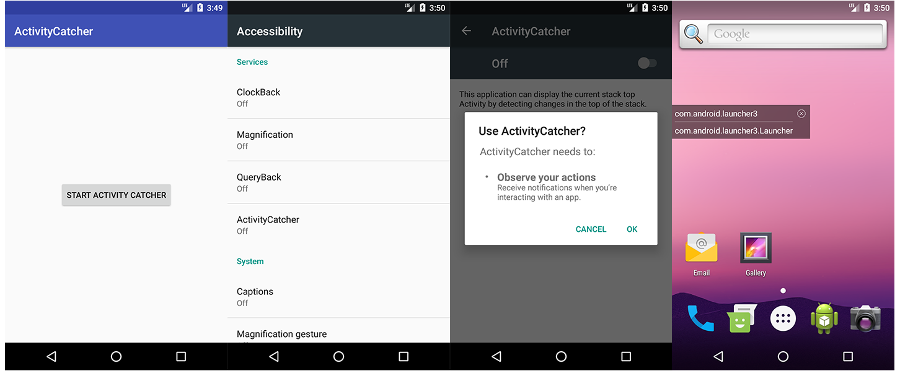

## Activity Catcher

README English [中文](README.md)

### Introduce

As a developer, is it hard to find bugs on thousands of pages as you face the company's huge engineering code?

What do you want to do when you see the architecture of other apps without decompiling?

If you have any of these problems, then this app can help you! This project is to display the Activity information currently in the foreground on the desktop suspension window by monitoring the top Acitivity of the stack.

### Principle

The Android assist feature(AccessibilityService) provides us with a series of event callbacks that help us indicate the status changes of some user interfaces.

We can derive auxiliary function classes and then process different accessibilityevents. Similarly, this service can be used to determine the current foreground application.

### Renderings

### Usage

1. Click to "START ACTIVITY CATCHER". At this point, you need to turn on the auxiliary function (accessibility).
2. When the auxiliary function is turned on, the app will be returned, and the hover window button will be clicked to use.

### Source Code

https://github.com/shijiacheng/ActivityCatcher

### Reference

http://effmx.com/articles/tong-guo-android-fu-zhu-gong-neng-accessibility-service-jian-ce-ren-yi-qian-tai-jie-mian/

