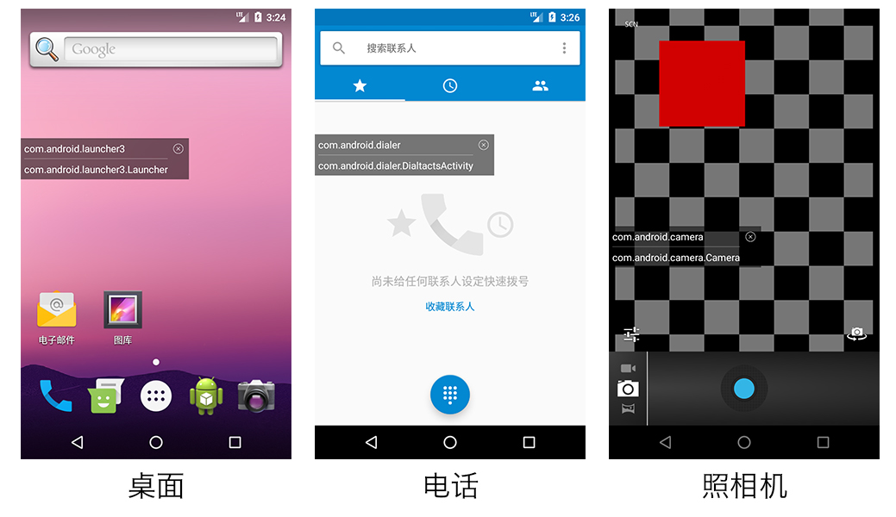
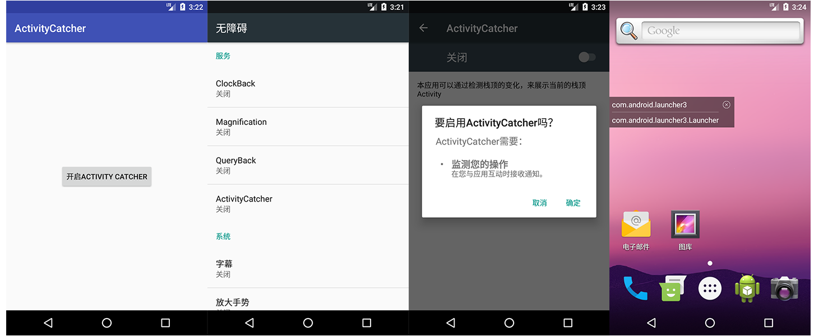

## Activity Catcher

README [English](README-EN.md) 中文

### 项目介绍

作为开发者的你在面对公司庞大的工程代码的时候，在万千页面中找到出现bug的那个是不是很费力？

想看看其他app的架构，不用反编译怎么办？

如果你有上述的烦恼，那么这个应用可以帮到你！本项目是通过监测栈顶Acitivity，在桌面悬浮窗上显示当前在前台的Activity信息。

### 原理
Android 辅助功能(AccessibilityService) 为我们提供了一系列的事件回调，帮助我们指示一些用户界面的状态变化。 我们可以派生辅助功能类，进而对不同的 AccessibilityEvent 进行处理。 同样的，这个服务就可以用来判断当前的前台应用

### 效果图

### 使用方法

1. 点击"开启ACTIVITY CATCHER"按钮。此时需要你开启辅助功能（无障碍功能）。
2. 开启辅助功能后，返回app，点击开启悬浮窗按钮，即可使用。

### 源码

https://github.com/shijiacheng/ActivityCatcher

### 参考

[通过ANDROID辅助功能「ACCESSIBILITYSERVICE」检测任意前台界面](http://effmx.com/articles/tong-guo-android-fu-zhu-gong-neng-accessibility-service-jian-ce-ren-yi-qian-tai-jie-mian/)

